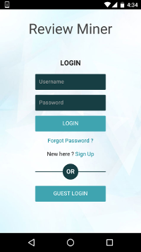
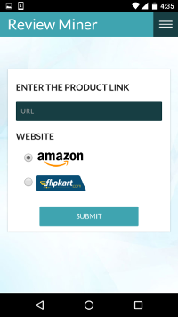
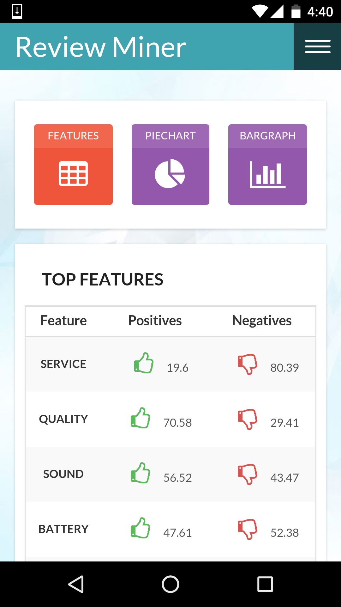
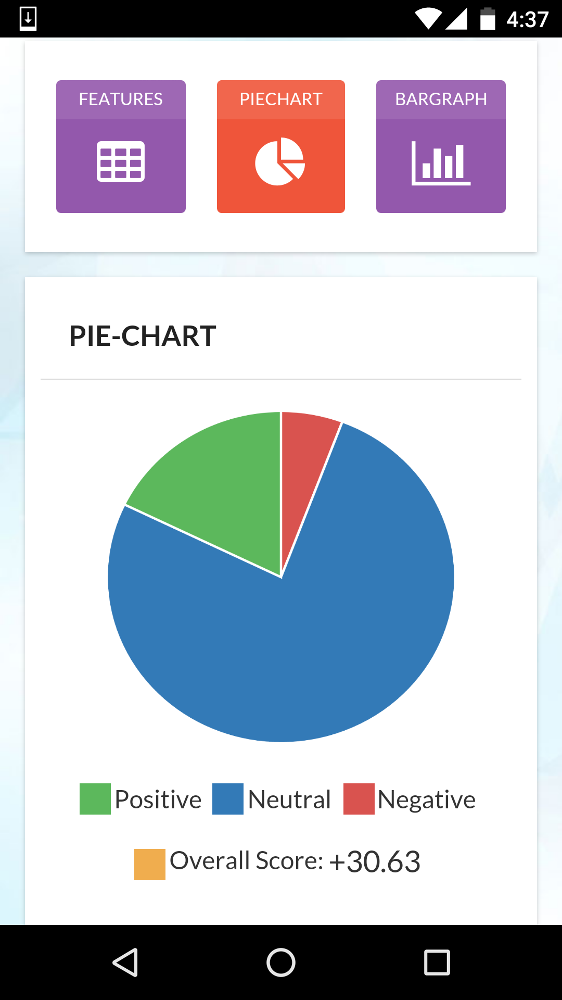
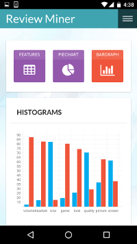

## Review-Miner 
A cross platform application which scrapes reviews from websites (Amazon and Flipkart) and extracts features, analyses sentiments and classifies features based on opinion. Easy to use and interactive UI.

### Setup:
1. Install PhoneGap and import the App_UI folder.   
2. Setup django and run the 'reviewminer' django project.   
3. Change the url in /App_UI/www/dashboard.html to wherever your django project is hosted. Not required if its running on your local server.  
4. Go to App_UI folder and run 'phonegap serve' in your terminal.   
5. Connect your phonegap app in your mobile to the served phonegap project.   

### Screenshots:  

 &nbsp; &nbsp; &nbsp; &nbsp;&nbsp;
 &nbsp; &nbsp; &nbsp; &nbsp;&nbsp;
  
&nbsp;&nbsp;&nbsp;&nbsp;&nbsp;&nbsp;&nbsp;&nbsp;&nbsp;&nbsp;&nbsp;&nbsp;&nbsp;&nbsp;&nbsp;&nbsp;&nbsp;&nbsp;&nbsp;&nbsp;&nbsp;&nbsp;&nbsp;&nbsp;&nbsp;&nbsp;&nbsp;&nbsp;&nbsp; &nbsp;&nbsp;&nbsp;&nbsp;&nbsp;&nbsp;&nbsp;
&nbsp;&nbsp;
